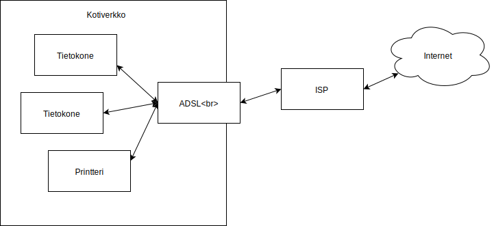

<lead>Kotiverkko on useimpien tavallisten internet-käyttäjien kannalta erittäin tärkeä osa internetiä. Tässä luvussa käydään läpi kotiverkon rakenne, tyypilliset laitteet ja  keskeinen toiminnallisuus. </lead>

## Kotiverkon rakenne ja verkkolaitteet

Kotiverkko on tyypillisesti yhdistetty palveluntarjoajan verkkoon laajakaistayhteydellä. Tällainen laajakaistayhteys palveluntarjoajan ja kotiverkon välillä on tyypillisesti toteutettu jollakin kolmesta yleisimmästä tekniikasta.

* Perinteisessä puhelinverkossa yhteys on yleensä toteutettu ADSL-tekniikalla ja kotiverkossa on ADSL-modeemi tai ADSL-verkkokytkin, joka on liitetty puhelinpistokkeeseen.
* Kaapelitelevisioverkkoon liitetyllä 'kaapelimodeemilla'.
* Suoraan kotijakamoon tulevalla parikaapelilla tai optisella kuidulla. Tämä on yhä yleisempi ratkaisu uusissa rakennuksissa ja peruskorjatuissa vanhemmissa rakennuksissa. Syynä on viestintäviraston määräys siitä, että tällainen toteutus edellytetään. (Jos haluat lukea koko määräyksen, niin se on Viestintäviraston [määräys kiinteistön sisäverkoista ja teleurakoinnista 65C/2018](https://www.finlex.fi/data/normit/44045/M_65_C_2018.pdf)

Useimmat kotiverkon internetin puoleisella reunalla oleva laitteet ovat monitoimilaitteita, jotka tarjoavat kotiverkolle muitakin palveluja kuin vain verkon liittämiseen tarvittavan kytkimen tai reitittimen. Hyvin tyypillisesti nämä laitteet toimivat langattoman verkon (wifi, WLAN) tukiasemana. Tällöin kotiverkon omassa sisäisessä rakenteessa ei tarvita kaapelointia, vaan laitteet voivat kommunikoida tämän langattoman verkon välityksellä.

Jotkut kotikäyttäjät käyttävät mobiililaitteillaan, kuten älypuhelin tai tabletti, suoraan palveluntarjoajan mobiiliverkkoa. Silloin heillä ei ole erillistä kotiverkkoa, vaan laitteet on suoraan liitetty palveluntarjoajan verkkoon. Tätä internetin käyttötapaa ei luokitella kotiverkoksi, koska käyttäjällä ei ole omaa aliverkkoa, vaan liikennöinti tapahtuu suoraan palveluntuottajan mobiiliverkossa.
 
Kotiverkon laitteet kommunikoivat siis omassa aliverkossaan keskenään ilman, että liikenne näkyy muualle. Ulkopuolisen internetin kanssa ne kommunikoivat reitittimen välityksellä.

### Yhteys kotiin

Suomessa näitä kotien internet-yhteyksiä kutsutaan usein laajakaistayhteyksiksi tai lyhyesti vain laajakaistaksi. Nimitystä voi Suomessa käyttää, kun operaattorin tarjoama liikennöintinopeus on yli 256 kbits/s ja laskutus ei perustu siirrettyyn datamäärään.

Tyypillisesti yhteys kotiin toteutetaan joko perinteistä puhelinverkkoa pitkin ADSL-yhteytenä, kaapeli-TV -verkossa kaapelimodeemin avulla tai asuntoon tulevan parikaapelin tai valokuidun kautta. Wikipedian [laajakaistaa käsittelevällä sivulla](https://fi.wikipedia.org/wiki/Laajakaista) luetellaan muitakin tekniikoita, joilla laajakaistayhteyden voi saada kotiin.

Näitä yhteyksiä tarjoavat puhelinoperaattorit, kuten Telia, Elisa ja DNA, ympäri maata. Myös muita palveluntarjoajia on alueellisesti saatavilla. Erityisesti, jos käytetään muita kuin puhelinverkon tekniikoita. 

Osa palveluntarjoajista näyttää myyvän valokuitu-nimistä palvelua, vaikka valokuitu tulisikin vain taloyhtiöön ja siitä eteenpäin liikennöinti tapahtuisi parikaapelilla.

Tietoliikenneyhteys voidaan rakentaa myös sähköverkon varaan. Tätä datasähköksi kutsuttua palveluakin on saatavilla eri puolilla maata. Kurkista esim. Nivos -nimisen yhtiön tarjontaa.

Joillakin alueilla kaupalliset toimijat eivät koe laajakaistayhteyden toteuttamista kannattavaksi ja laajakaistayhteyttä tarjotaankin siellä täällä myös osuuskuntina. Esimerkiksi Verkko-osuuskunta Ylläksen Laajakaista tarjoaa laajakaistayhteyttä Ylläksellä.

<quiznator id="5c77f8fcddb6b814af327046"></quiznator>

### Kotiverkon ja internetin välinen laite

Käytettävästä verkkotekniikasta riippuen laitteen nimi voi olla ADSL-modeemi, valokuitumuunnin, laajakaistareititin tai jotain muuta. Eri operaattoreilla on tälle laitteelle ja sen avulla tarjottavalle verkkopalvelulle erilaisia tuotenimiä kuten kotiboksi, valokuitu plus tai ihan vain laajakaista tai netti.

ADSL-modeemi on perinteinen tapa yhdistää kotiverkko internetiin. Siinä palveluntarjoajana toimii puhelinoperaattori. Yhteys muodostetaan olemassa olevaa langallista puhelinverkkoa pitkin.  Tämä on vähitellen poistuva tekniikka Suomesta, kun operaattorit pikkuhiljaa purkavat vanhoja puhelinverkkoja ja korvaavat ne nopeammilla verkkoyhteyksillä.

Kaapelimodeemin avulla internet-yhteys kotiverkkoon voidaan saada kaapeli-TV:tä tarjoavalta operaattorilta. Pääkaupunkiseudulla tämä palvelun tarjoaja on yleensä DNA. 

Kuitumuunnin on näistä uusin ja silloin valokuituyhteys tarvitaan tähän muuntimeen asti. Jos kotiin tulee suoraan Ethernetiä käyttävä parikaapeliyhteys, niin silloin voidaan käyttää tavanomaista reititintä. 

Kotiverkon ja palveluntarjoajan verkon välissä on aina reititin. Yleensä reititystä kotiverkossa hoitaa tämä verkkoja toisiinsa liittävä laite, mutta teknisesti olisi mahdollista jättää reititys kokonaan operaattorin huoleksi. Käytännössä oman kotiverkon turvallisuuden vuoksi on hyvä, että kotiverkon oma sisäinen liikenne ei vuoda operaattorille asti ja siksi tarvitaan reititin oman verkon puolelle. 
Muistathan, että reititys on protokollapinon verkkokerroksen toiminnallisuutta ja yhteystekniikka kuuluu linkkikerrokselle.

Monitoimilaitteessa on linkkikerroksen yhteystekniikoiden ja verkkokerroksen reititystoiminnallisuuden lisäksi yleensä myös langattoman verkon wifi-tukiasema ja usein myös palomuuri. Palomuurin tehtävänä on suojata kotiverkon liikennettä siten, että kotiverkkoon asti pääsee vain sinne aidosti kuuluva liikenne. Palataan palomuureihin myöhemmin tällä kurssilla. 

Kaikissa näissä laitteissa on yksi liitin operaattorin verkkoon liittymistä varten sekä 0-4 liitintä kotiverkon laitteille.

### Laitteiden liittäminen kotiverkkoon
 
Kotiverkon laitteet voidaan liittää Ethernet-kaapeloinnilla kotiverkon reitittimeen joko suoraan reitittimen porttiin tai jos reitittimessä ei ole riittävästi portteja niin lisäämällä verkkoon esimerkiksi kytkimiä, joilla yhteen reitittimen porttiin voidaan liittää useita laitteita liittämällä ne ensin kytkimen portteihin ja vain kytkin liitetään reitittimeen.

Mikäli kaapelointia ei ole tai sitä ei haluta asentaa, niin silloin yleensä otetaan käyttöön langaton lähiverkko (Wireless local area network, WLAN), joka tarvitsee sitten tukiaseman. Näistä tukiasemista käytetään sekä nimeä WLAN-tukiasema että wifi-tukiasema.  (Termeistä löydät lisätietoja Wikipedian [WLAN-artikkelista](https://fi.wikipedia.org/wiki/WLAN).

Joissakin tilanteissa on mahdollista käyttää sähköverkon kaapelointia ethernet-signaalin siirtoon erillisten lisälaitteiden avulla. Vaihtoehtoja siis riittää ja eri tilanteissa on hyvä kartoittaa vaihtoehdot kunnolla ja tehdä sen jälkeen valinta. Olen itsekin kerrostaloasunnossa käyttänyt tällaista "ethernet over power" laitetta saadakseni ethernet-yhteyden tietokoneelle, jota ei voinut liittää langattomaan verkkoon ja joka oli hankalassa paikassa erillistä tietoliikennekaapelointia varten.
 

### WLAN-tukiasema vai WLAN-reititin

WLAN-tukiasema tarjoaa verkkoyhteyden palveluna kaikille laitteille, jotka siihen on yhdistetty. Jos se tarjoaa vain liikennöintiä, niin se välittää kaiken liikenteen langattoman ja langallisen verkon välillä ja toimii silloin tyhmänä toistimena (repeater). Tällaisia erillisiä WLAN-toistimia saatetaan tarvita isommassa omakotitalossa useita, jotta kaikkialla olisi hyvä kuuluvuus. Langaton Wifi-signaali vaimenee tehokkaasti sekä etäisyyden mukana että erilaisten radioaaltoja huonosti läpäisevien materiaalien vuoksi.

WLAN-reititin tarjoaa langattoman yhteyden lisäksi myös reitityksen langattomaan verkkoon liitettyjen laitteiden ja langallisen verkon laitteiden välillä. Näin meille syntyy kaksi toisistaan loogisesti eristettyä verkkoa. Langattoman verkon laitteiden kommunikoidessa keskenään niiden liikennettä ei ohjata eteenpäin langalliseen verkkoon. Kotiverkko jakautuukin kahteen aliverkkoon, joista toinen on langallinen ja toinen langaton.

<quiznator id="5c78ea6014524713f95a65fb"></quiznator>

