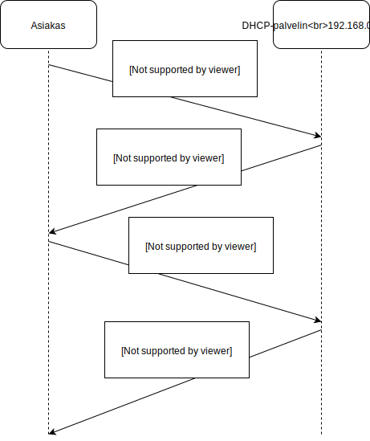

# Kotiverkon palvelut

Kotiverkon laitteiden tarvitsevat verkkopalvelut eivät poikkea tietoverkkoon liitettyjen laitteiden tarvitsemista palveluista. Kaikki laitteet tarvitsevat itselleen oman IP-osoitteen, jonka avulla ne voidaan tunnistaa. Niiden pitää myös pystyä löytämään muiden laitteiden IP-osoitteita, jotta ne voivat lähettää näille viestejä. 

## Konfigurointi (DHCP)

Kaikki verkkoon liitetyt laitteet tarvitsevat IP-osoitteen, jotta ne voivat kommunikoida muiden kanssa käyttäen IP-protokollaa. Tämä osoite annettiin aikoinaan jokaiselle laitteelle käsin kirjoittamalla se sopivaan tiedostoon laitteen asetuksissa. Tietokoneiden ja verkkolaitteiden määrän kasvaessa osoitteiden päivittäminen käsin muuttui aivan liian työlääksi ja siksi kehitettiin protokolla, jolla verkkoon liitettävä laite voi itse automaattisesti pyytää IP-osoitetta erilliseltä palvelimelta. Tämä Dynamic Host Configuration Protocol (DHCP) pohjautuu aiempiin vastaaviin protokolliin, mutta se on siis tällä hetkellä yleisimmin käytetty tapa saada verkkoon liitettävälle tietokoneelle tai muulle laitteelle IP-osoite. DHCP-protokollan määrittelyssä on kuvattuna useita erilaisia protokollan käyttötapoja. Tässä materiaalissa käydään niistä läpi vain tämä verkkoon liittyvän laitteet tarvitsema viestien vaihtoprosessi.

DHCP-protokollassa asiakas aloittaa viestien vaihdon. Tämä on hyvin tyypillistä protokollille, koska yleensä asiakkaalla on jokin tarve ja palvelin on koko ajan valmiina vastaamaan asiakkaille. 

* Asiakas lähettää ensin DHCPDiscover-viestin verkkoon. Miten asiakas voi tämän viestin lähettää palvelimelle, kun ei se tiedä palvelimen osoitetta, eikä sillä vielä ole omaakaan osoitetta? Internetissä asia on ratkaistu siten, että laitteet voivat yhden vastaanottajan sijaan lähettää yhden ja saman viestin kaikille verkon laitteille. Tätä kaikille lähetettävää viestiä kutsutaan <b>yleislähetykseksi</b> ja sille on varattu ihan oma IP-osoite (255.255.255.255), jota ei siis voi käyttää mihinkään muuhun viestien välittämiseen kuin yleislähetykseen kaikille. DHCP käyttää porttinumeroita 67 ja 68, joilla sille saapuvat viestit on mahdollista erottaa muiden sovellusten ja niiden protokollien viesteistä.
* Palvelin vastaanottaa tämän viestin ja vastaa siihen DHCPOffer viestillä. Palvelin siis tarjoaa asiakkaalle yhtä IP-numeroa. Tämäkin viesti täytyy lähettää yleislähetyksenä, kun palvelimella ei ole keinoa yksilöidä asiakasta. Edellinen pyyntö ja tämä siihen tuleva vastaus yhdistetään toisiinsa viestin sisällä kulkevalla tunnisteella, joka on tässä viestiparissa sama.
* DHCP:n erikoisuus on se, että protokollan mukaan yhdessä verkossa saa olla useita DHCP-palvelimia, jotka kaikki voivat ehdottaa asiakkaalle IP-numeroa. Asiakas päättää minkä tarjotuista IP-numeroista se ottaa käyttöönsä.  Asiakkaan pitääkin siksi vielä tarkistaa palvelimelta, että saanhan pitää tämän IP-osoitteen. Tämä tehdään DHCPRequest-viestillä.
* Palvelija kuittaa ja hyväksyy osoitteen käytön DHCPAck-viestillä.

Tämän viestien vaihdon yhteydessä palvelin voi toimittaa asiakkaalle myös muita verkon konfiguraation kannalta oleellisia tietoja. Näitä ovat tyypillisesti nimipalvelimen osoite, ulospäin menevän liikenteen oletusreitittimen osoite (default gateway) ja IP-osoitteen laina-aika. Laina-ajan päätyttyä asiakaan pitää erillisellä DHCP-protokollan viestillä tarkistaa palvelimelta saako se vielä käyttää tätä IP-osoitetta. 

EXTRA: Jos sinua kiinnostaa opetella tarkemmin DHCP-protokollan toimintaa, niin englanninkielinen wikipedian [asiaa käsittelevä sivu](https://en.wikipedia.org/wiki/Dynamic_Host_Configuration_Protocol) on hyvä lähtökohta. Sieltä löytyy linkit noihin DHCP:n toiminnallisuuden määritteleviin RFC-dokumentteihin.

## Nimipalvelu (DNS)

Nykyään kaikissa internet-verkon osissa on käytössä nimipalvelu (Domain Name Service, DNS). Nimipalvelu on maailmanlaajuinen, koko laajan internet-verkon kattava palvelu, joka pitää huolta verkon laitteiden nimien ja IP-osoitteiden kuvaamisesti toisilleen. Esimerkiksi pyytämällä www.helsinki.fi nimen tietoja nimipalvelusta saadaan tiedoksi, että "www.helsinki.fi canonical name adc-vip3.helsinki.fi" ja edelleen että "Name: adc-vip3.helsinki.fi Address: 128.214.189.90". Näistä tiedoista voidaan päätellä, että Helsingin yliopiston www-palvelu toimii tietokoneella, jonka nimi on adv-vip3.helsinki.fi ja sen IPv4 osoite on 128.214.189.90.

Kaikilla IP-osoitteilla ei ole pakko olla nimeä, mutta jos nimelle ei löydy IP-osoitetta, niin sen kanssa ei voi kommunikoida. Vastaavasti kaikilla IP-osoitteilla ei ole nimeä. Tämä ei kuitenkaan estä kommunikointia kyseisen IP-osoitteen kanssa.

-- quiz: Nimipalvelu

<quiznator id="5c7ceb5a017ffc13eddcfa1a"></quiznator>

Mooc.fi on toteutustapansa vuoksi hiukan hankalampi nimipalvelun osalta. Kyselyllä "nslookup mooc.fi" vastaukseksi tulee useita IP-osoitteita. Tämä johtuu siitä, että mooc.fi on toteutettu pilvipalveluna ja kyseisellä pilvipalvelulla on käytössään sekä useita IP-osoitteita, että kuormatasauksen vuoksi tarve jakaa nimipalvelun kautta useita osoitteita, jolloin eri asiakkaan ottavat yhteyttä eri osiin pilveä ja näin kaikki saavat palvelua sujuvasti. Jos kaikki yrittäisivät yhteyttä samaan kohtaa se voisi tukkeutua, jolloin osa ei ehkä saisi palvelua lainkaan ja useimmilla sivu toimisi todella hitaasti.

Kotiverkon kannalta kiinnostavin seikka on, että miten oman kotiverkon laitteet tietävät oman nimipalvelijan osoitteen. Aikoinaan tämä osoite täytyi kertoa laitteelle suoraan kirjoittamalla se sopivaan tiedostoon, mutta nykyään se onneksi saadaan samalla DHCP-kyselyllä kuin laitteen oma IP-osoite. DHCP-kyselyn mukana tulee paljon hyödyllistä konfigurointitietoa, joista yksi on nimipalvelijan osoite.

Kotiverkkoa palvelee yleensä aina oman palveluntarjoajan nimipalvelin, joka sitten yhdessä muiden maailman nimipalvelijoiden kanssa ratkoo asiakkaiden tekemät kyselyt. Wikipedian [DNS-palvelua käsittelevä artikkeli](https://fi.wikipedia.org/wiki/DNS) kertoo lyhyesti tästä nimipalvelijoiden yhteistyöstä. Nimipalvelun sisäinen toiminta jätetään valitettavasti tältä aloituskurssilta pois, kun kaikki kiinnostava asia ei mahdu mukaan.

Tietoturvan vuoksi kotiverkossa ei pitäisi olla omaa erillistä nimipalvelijaa, koska palveluntarjoajan nimipalvelu yleensä riittää. Mikäli kotiverkossa on oma erillinen nimipalvelija, niin sitten sen päivittämisistä pitää huolehtia, jotta se pysyy turvallisena. Valitettavasti aina silloin tällöin on vastaan tullut oletusasetuksiltaan turvattomia laitteita. Yksi tällainen saattaa olla laitteissa toimiva nimipalvelin, silloinkin kun sillä ei aidosti ole tarvetta. Tällainen ylimääräinen, mahdollisesti jopa avoin nimipalvelu on yksi mahdollinen reitti hyökkäyksille / tunkeutumisille. Tämän kaltaisten ongelmien selvittämisessä oman palveluntarjoajan apu on usein tarpeen.

## Osoitteiden muunnos (NAT)

Osoitteiden muunnosta (Network address translation, NAT) käytetään silloin, kun omia yksityisiä verkkoja liitetään julkiseen internetiin. Verkon yksityisyys määräytyy sen käyttämien IP-osoitteiden kautta. Julkisen verkon IP-osoitteet täytyy erikseen anoa. Yksityisen verkon IP-osoitteet eli osoiteavaruudet 192.168.0.0 - 192.168.255.255, 172.16.0.0 - 172.31.255.255 ja 10.0.0.0 - 10.255.255.255 ovat kaikkien käytettävissä. Usein kotiverkon DHCP-palvelin käyttää noita B-luokan osoitteita osoiteavaruudesta 192.168.x.x.

Näillä osoitteilla ei siis saa liikennöidä julkisessa internetissä ja siksi oman kotiverkon ja palveluntarjoajan verkon yhdistävässä kohdassa täytyy olla laite, joka tekee osoitteen muunnoksen yksityisen verkon osoitteesta julkisen verkon osoitteeksi ja päinvastoin. Osoitteenmuunnos edellyttää, että NAT-laite pitää kirjaa mistä oman verkon osoitteesta lähetettiin viestejä mihin julkisen verkon osoitteeseen, jotta se osaa vastausviestit ohjata oikealle yksityisen verkon laitteelle. Tarkempaa tietoa osoitteenmuunnosten tekniikasta on esimerkiksi wikipedian [asiaa käsittelevällä sivulla](https://fi.wikipedia.org/wiki/Osoitteenmuunnos).

Käydään IP-osoitteet ja osoitteenmuunnokset sekä niiden käyttö reitityksen apuna tarkemmin osiossa 4, kun tutustutaan verkkokerroksen toiminnallisuuteen. Jos jo nyt haluat lukea tarkemmin IP-osoitteista, niin wikipedia [niitä käsittelevä sivu](https://fi.wikipedia.org/wiki/IP-osoite) on hyvä suomenkielinen kuvaus aiheesta.

-- quiz: yksityiset osoitteet

<quiznator id="5c7cf1acddb6b814af3277b9"></quiznator>

